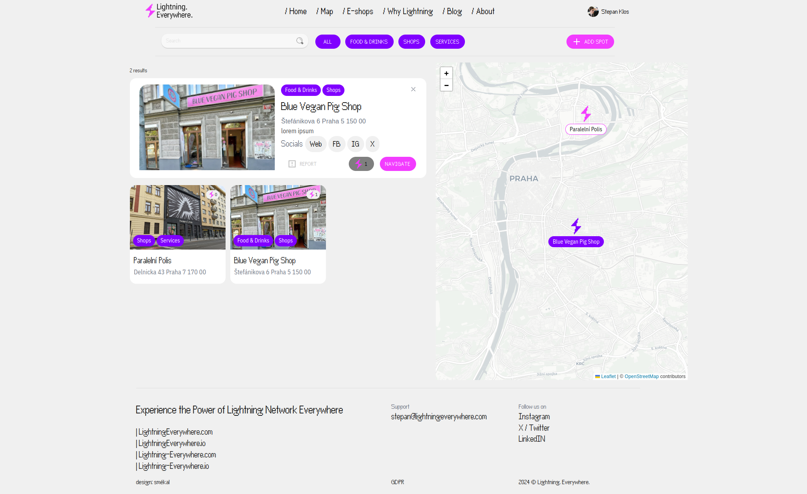

# Lightning Everywhere
This project aims to collect all available `Spots` & `E-shops` that accept Lightning Network.

## Design
https://www.figma.com/design/0xgUxXI1FKn5PJYybNnAyv/LightningEverywhere?node-id=32-11&t=zdPUxTvmZHIG2Hsj-0

## Preview
Everybody will be able to Register / Sign Up With Google to add pin to our map soon. 
<p align="center">
  
</p>

## IN PROGRESS

## Dev // Build & push
First build and then push into Dockerhub
```
docker build -t stepanklos/lightningeverywhere .
```
```
docker push stepanklos/lightningeverywhere
```
## Dev // Run it!
```
git clone https://github.com/KlosStepan/Lightning-map
npm install
npm start
```
## Dev // For Local Development with `direnv`  
In `projects/Lightning-map` create `.envrc` with following content
```
export REACT_APP_FIREBASE_API_KEY="xyz"
export REACT_APP_FIREBASE_AUTH_DOMAIN="xyz"
export REACT_APP_FIREBASE_PROJECT_ID="xyz"
export REACT_APP_FIREBASE_STORAGE_BUCKET="xyz"
export REACT_APP_FIREBASE_MESSAGING_SENDER_ID="xyz"
export REACT_APP_FIREBASE_APP_ID="xyz"
export REACT_APP_FIREBASE_MEASUREMENT_ID="xyz"

export REACT_APP_DEBUG=true
export REACT_APP_BLOG=false
```  
and then use `direnv allow` which results in  
```
[stepo@archlinux Lightning-map]$ direnv allow
direnv: loading ~/projects/Lightning-map/.envrc
direnv: export +REACT_APP_FIREBASE_API_KEY +REACT_APP_FIREBASE_APP_ID +REACT_APP_FIREBASE_AUTH_DOMAIN +REACT_APP_FIREBASE_MEASUREMENT_ID +REACT_APP_FIREBASE_MESSAGING_SENDER_ID +REACT_APP_FIREBASE_PROJECT_ID +REACT_APP_FIREBASE_STORAGE_BUCKET
```  
to ensure full functionality.
