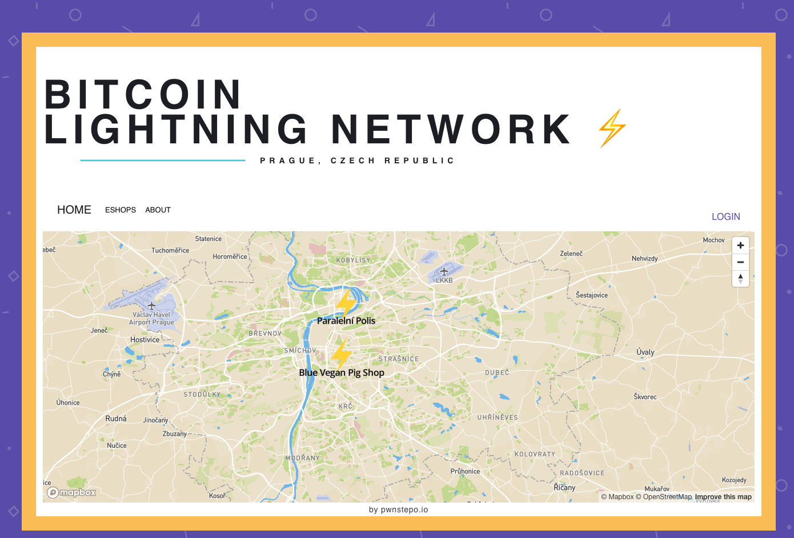

# Lightning Map
This project is a map website mostly for merchat collection & display of places that accept Lightning Network in Prague, Czech Republic.  

## Run it!
```
git clone https://github.com/KlosStepan/Lightning-map
npm install
npm start
```
## Preview
Everybody will be able to Register / Sign Up With Google to add pin to our map! 
<p align="center">
  
</p>

## Color schema & design
- black
- orange #FAC55E - bitcoin color
- purple #6354B3 - lightning color


## map
For map we use service called Mapbox wrapped for ReactJS installed as npm package. 
```jsx 
// eslint-disable-next-line import/no-webpack-loader-syntax   
mapboxgl.workerClass = require("worker-loader!mapbox-gl/dist/mapbox-gl-csp-worker").default;  
```