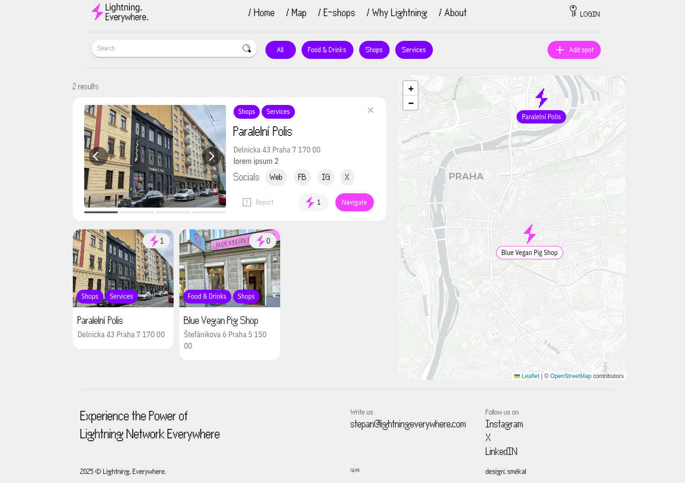

# Lightning Everywhere
This project aims to collect all available `Merchants` & `E-shops` that accept Lightning Network.

## Design
https://www.figma.com/design/0xgUxXI1FKn5PJYybNnAyv/LightningEverywhere?node-id=32-11&t=zdPUxTvmZHIG2Hsj-0

## Preview
Everybody will be able to Register / Sign Up With Google to add pin to our map soon. 
<p align="center">
  
</p>

## IN PROGRESS

## Dev // Build & push
First build and then push into Dockerhub
```
docker build -t stepanklos/lightningeverywhere .
```
```
docker push stepanklos/lightningeverywhere
```
## Dev // Run it!
```
git clone https://github.com/KlosStepan/Lightning-map
npm install
npm start
```
## Dev // For Local Development with `direnv`  
In `projects/Lightning-map` create `.envrc` with following content
```
export REACT_APP_DEBUG=true
export REACT_APP_BLOG=false
```  
and then use `direnv allow` which results in  
```
[stepo@archlinux Lightning-map]$ direnv allow
direnv: loading ~/projects/Lightning-map/.envrc
direnv: export ...
```  
to ensure full functionality.

## Last TODOs before release
Lightning Everywhere notes
- if not connected, load dummy json w/ disabled places
- About, tiles type (pizza guy, Ross, Polis CZ, blue pig -> be next) some schema, or 5th arrows +
- Admin's /admin section 4 (icons, lists) - not pretty, mby approved by default if user OK (legit mail, captcha)
- About beneath, Why project, About Author, Costs burnt, Support boiz (more like 1/4 par than tile)
- make sure to take out all unused code & have debug in place correctly (!)
- layouts that are same: Home + E-shops + About // Map + Why Lightning
- content todo real photos/videos(or gifs)  

Maybe some linter and rules for the project.  
README.md  - write guidelines (imports order, component before return order).  
Finalize UIKit page with all possibilities and settings for documentation and quick usability.

