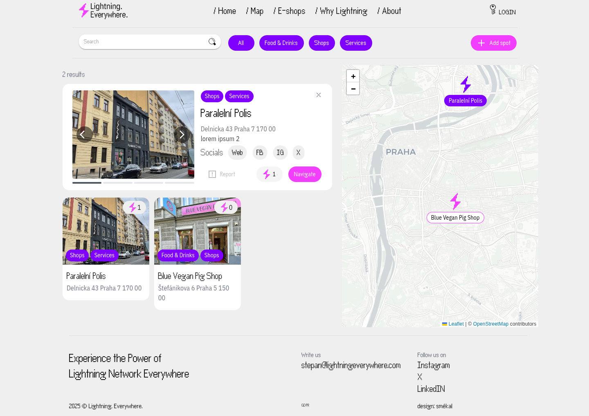
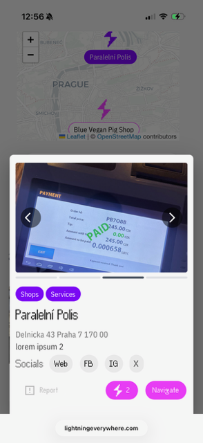

# Lightning Everywhere
This project aims to collect all available `Merchants` & `E-shops` that accept Lightning Network worldwide.

## Figma  design: smékal [^1]
https://www.figma.com/design/0xgUxXI1FKn5PJYybNnAyv/LightningEverywhere?node-id=32-11&t=zdPUxTvmZHIG2Hsj-0

## Preview
Everybody will be able to Register / Sign Up With Google to add pin to our map. 
<p align="center">
  <!-- Desktop (75% width) -->
  
  <span>&nbsp;</span>
  <!-- Mobile (25% width, tall screenshot) -->
  
</p>

## Dev // Build & push
First build and then push into Dockerhub
```
docker build -t stepanklos/lightningeverywhere .
```
```
docker push stepanklos/lightningeverywhere
```
## Dev // Run Locally
```
git clone https://github.com/KlosStepan/Lightning-map
npm install
npm start
```
## Dev // Vars For Local Dev 
In `projects/Lightning-map` create `.envrc` with following content
```
export REACT_APP_DEBUG=true
export REACT_APP_BLOG=false
export REACT_APP_API_BASE_URL="http://localhost:8080/api"
export REACT_APP_GOOGLE_CLIENT_ID=
```  
then use direnv [^2] run `direnv allow` which looks like  
```
[stepo@archlinux Lightning-map]$ direnv allow
direnv: loading ~/projects/Lightning-map/.envrc
direnv: export +REACT_APP_API_BASE_URL +REACT_APP_BLOG +REACT_APP_DEBUG +REACT_APP_GOOGLE_CLIENT_ID
```  
to ensure full functionality.

## Last TODOs before release
Lightning Everywhere notes
- ~~if not connected, load dummy json w/ disabled places~~
- ~~About, tiles type (pizza guy, Ross, Polis CZ, blue pig -> be next) some schema, or 5th arrows +~~
- ~~Admin's /admin section 4 (icons, lists) - not pretty, mby approved by default if user OK (legit mail, captcha) //disabled in comemnts~~
- ~~About beneath, Why project, About Author, Costs burnt, Support boiz (more like 1/4 par than tile) //not now~~
- ~~make sure to take out all unused code & have debug in place correctly (!) //probably yes~~
- ~~layouts that are same: Home + E-shops + About // Map + Why Lightning~~
- better content TODO, real photos/videos(or gifs) in website.  

[x] Maybe some linter and rules for the project.   
~~README.md  - write guidelines (imports order, component before return order).~~  
~~Finalize UIKit page with all possibilities and settings for documentation and quick usability. //somehow, not needed fully~~

Long live https://lightningeverywhere.com/

[^1]: https://filipsmekal.cz/
[^2]: https://man.archlinux.org/man/direnv.1.en