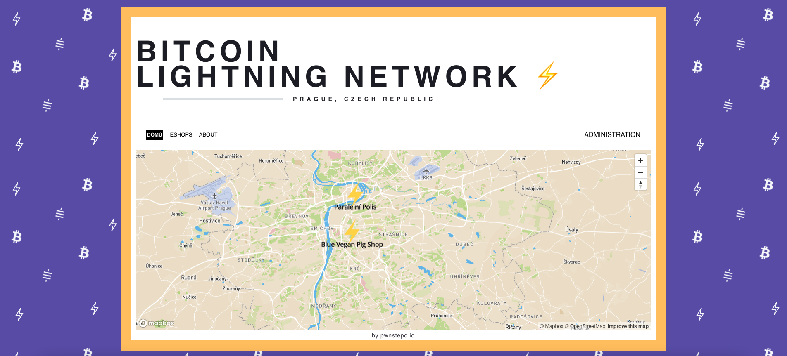

# Lightning Map
This project is a map website mostly for merchat collection & display of places that accept Lightning Network in Prague, Czech Republic.  

## Run it!
```
git clone https://github.com/KlosStepan/Lightning-map
npm install
npm start
```
## Preview
Everybody will be able to Register / Sign Up With Google to add pin to our map soon! 
<p align="center">
  
</p>

## Design
These colors are used in our application: 
- Black  `#000000` - normal.
- Orange  `#FAC55E` - Bitcoin.
- Purple  `#6354B3` - Lightning.

Symbols for background (their 32x32 icon `png` equivalent in  `#F6F8FA`):
- Bitcoin ₿ (12.5deg. rot).
- Lightning ⚡.
- Satoshi  (12.5deg. rot.).  

Logo edits like https://shallowsky.com/blog/gimp/gimp-black-to-color.html
___
## // Map fiddle
For map we use service called Mapbox wrapped for ReactJS installed as npm package. 
```jsx 
// eslint-disable-next-line import/no-webpack-loader-syntax   
mapboxgl.workerClass = require("worker-loader!mapbox-gl/dist/mapbox-gl-csp-worker").default;  
```

___ 
## // Build&push
First run to build and then push into Dockerhub/
```
docker build -t stepanklos/lightning_map .
```
```
docker push stepanklos/lightning_map
```

## For Local Dev w/ `direnv`  
In `projects/Lightning-map` create `.envrc` with following content
```
export REACT_APP_FIREBASE_API_KEY="xyz"
export REACT_APP_FIREBASE_AUTH_DOMAIN="xyz"
export REACT_APP_FIREBASE_PROJECT_ID="xyz"
export REACT_APP_FIREBASE_STORAGE_BUCKET="xyz"
export REACT_APP_FIREBASE_MESSAGING_SENDER_ID="xyz"
export REACT_APP_FIREBASE_APP_ID="xyz"
export REACT_APP_FIREBASE_MEASUREMENT_ID="xyz"
```  
and then use `direnv allow` which results in  
```
[stepo@archlinux Lightning-map]$ direnv allow
direnv: loading ~/projects/Lightning-map/.envrc
direnv: export +REACT_APP_FIREBASE_API_KEY +REACT_APP_FIREBASE_APP_ID +REACT_APP_FIREBASE_AUTH_DOMAIN +REACT_APP_FIREBASE_MEASUREMENT_ID +REACT_APP_FIREBASE_MESSAGING_SENDER_ID +REACT_APP_FIREBASE_PROJECT_ID +REACT_APP_FIREBASE_STORAGE_BUCKET
```  
to ensure full functionality.